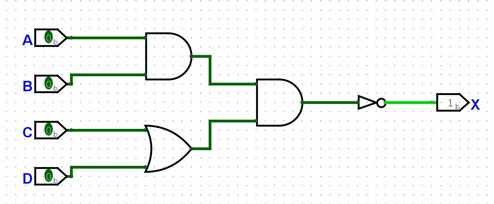

<h1 style="text-align: center;">Arquitectura de Computadores</h1>

## Actividad 19 de mayo 

Juan Esteban Bedoya Lautero 20231020057
Brayan Estiven Aguirre Aristizabal - 20231020156
Jonathan Esteban Cruz Fuentes - 20231020098

### sección 3-8

Para cada una de las siguientes expresiones, construya el circuito lógico correspondiente utilizando compuertas AND y OR e INVERSORES.

**(a) x = \( \overline{AB(C+D)} \)**

**(b) x = \( \overline{(A + B + \overline{C}D\overline{E})} + \overline{B}C \overline{D} \)**

**(c) y = \( (\overline{M + N} + \overline{P}Q) \)**

### sección 3-11 y 3-12
Demuestre los teoremas de DeMorgan probando todos los casos posibles.
Simplifique cada una de las siguientes expresiones usando los teoremas de DeMorgan.

**(a) \( \overline{\overline{A}B\overline{C}} \)**

Simplificando:
\( \overline{\overline{A}B\overline{C}} \)
= \( \overline{\overline{A}} + \overline{B} + \overline{\overline{C}} \)
= \( A + \overline{B} + C \)

Demostrando con tablas de verdad:
| \(A\) | \(B\) | \(C\) | \(\overline{A}\) | \(\overline{C}\) | \(\overline{A}B\overline{C}\) | \(\overline{\overline{A}B\overline{C}}\) |
|:---:|:---:|:---|----:|:----:|:-------------:|:----------------:|
| 0 | 0 | 0 |  1 |  1 |      0      |        1       |
| 0 | 0 | 1 |  1 |  0 |      0      |        1       |
| 0 | 1 | 0 |  1 |  1 |      1      |        0       |
| 0 | 1 | 1 |  1 |  0 |      0      |        1       |
| 1 | 0 | 0 |  0 |  1 |      0      |        1       |
| 1 | 0 | 1 |  0 |  0 |      0      |        1       |
| 1 | 1 | 0 |  0 |  1 |      0      |        1       |
| 1 | 1 | 1 |  0 |  0 |      0      |        1       |

| \(A\) | \(B\) | \(C\) | \(\overline{B}\) | \(A + \overline{B} + C\) |
|:----:|:----:|:----:|:--------------:|:-----------------------:|
| 0    | 0    | 0    |       1        |            1            |
| 0    | 0    | 1    |       1        |            1            |
| 0    | 1    | 0    |       0        |            0            |
| 0    | 1    | 1    |       0        |            1            |
| 1    | 0    | 0    |       1        |            1            |
| 1    | 0    | 1    |       1        |            1            |
| 1    | 1    | 0    |       0        |            1            |
| 1    | 1    | 1    |       0        |            1            |

**(b) \( \overline{\overline{A}  + \overline{B}C} \)**

Simplificando:
\( \overline{\overline{A}  + \overline{B}C} \)
= \( \overline{\overline{A}}(\overline{\overline{B}C}) \)
= \( A(\overline{\overline{B}} +\overline{C}) \)
= \( A(B +\overline{C}) \)

Demostrando con tablas de verdad:
| \(A\) | \(B\) | \(C\) | \(\overline{A}\) | \(\overline{B}\) | \(\overline{B}C\) |        \(\overline{A} + \overline{B}C\)        | \(\overline{\overline{A} + \overline{B}C}\) |
|:----:|:----:|:----:|:--------------:|:--------------:|:------------------:|:---------------------------------------------:|:------------------------------------------:|
|  0   |  0   |  0   |       1        |       1        |         0          |                      1                        |                    0                       |
|  0   |  0   |  1   |       1        |       1        |         1          |                      1                        |                    0                       |
|  0   |  1   |  0   |       1        |       0        |         0          |                      1                        |                    0                       |
|  0   |  1   |  1   |       1        |       0        |         0          |                      1                        |                    0                       |
|  1   |  0   |  0   |       0        |       1        |         0          |                      0                        |                    1                       |
|  1   |  0   |  1   |       0        |       1        |         1          |                      1                        |                    0                       |
|  1   |  1   |  0   |       0        |       0        |         0          |                      0                        |                    1                       |
|  1   |  1   |  1   |       0        |       0        |         0          |                      0                        |                    1                       |

| \(A\) | \(B\) | \(C\) | \(\overline{C}\) | \(B + \overline{C}\) | \(A(B + \overline{C})\) |
|:----:|:----:|:----:|:-----------------:|:---------------------:|:------------------------:|
|  0   |  0   |  0   |        1          |           1           |            0             |
|  0   |  0   |  1   |        0          |           0           |            0             |
|  0   |  1   |  0   |        1          |           1           |            0             |
|  0   |  1   |  1   |        0          |           1           |            0             |
|  1   |  0   |  0   |        1          |           1           |            1             |
|  1   |  0   |  1   |        0          |           0           |            0             |
|  1   |  1   |  0   |        1          |           1           |            1             |
|  1   |  1   |  1   |        0          |           1           |            1             |

**(c) \( \overline{AB \overline{CD}}\)**

Simplificando:
\( \overline{AB \overline{CD}}\)
= \( \overline{A} + \overline{B} + \overline{\overline{CD}}\)
= \( \overline{A} + \overline{B} + (CD)\)
 
Demostrando con tablas de verdad:
| \(A\) | \(B\) | \(C\) | \(D\) | \(CD\) | \(\overline{CD}\) | \(AB\) | \(AB \overline{CD}\) | \(\overline{AB \overline{CD}}\) |
|:----:|:----:|:----:|:----:|:----:|:------------------:|:-----:|:--------------------------:|:------------------------------------:|
|  0   |  0   |  0   |  0   |  0   |         1          |   0   |             0              |                 1                    |
|  0   |  0   |  0   |  1   |  0   |         1          |   0   |             0              |                 1                    |
|  0   |  0   |  1   |  0   |  0   |         1          |   0   |             0              |                 1                    |
|  0   |  0   |  1   |  1   |  1   |         0          |   0   |             0              |                 1                    |
|  0   |  1   |  0   |  0   |  0   |         1          |   0   |             0              |                 1                    |
|  0   |  1   |  0   |  1   |  0   |         1          |   0   |             0              |                 1                    |
|  0   |  1   |  1   |  0   |  0   |         1          |   0   |             0              |                 1                    |
|  0   |  1   |  1   |  1   |  1   |         0          |   0   |             0              |                 1                    |
|  1   |  0   |  0   |  0   |  0   |         1          |   0   |             0              |                 1                    |
|  1   |  0   |  0   |  1   |  0   |         1          |   0   |             0              |                 1                    |
|  1   |  0   |  1   |  0   |  0   |         1          |   0   |             0              |                 1                    |
|  1   |  0   |  1   |  1   |  1   |         0          |   0   |             0              |                 1                    |
|  1   |  1   |  0   |  0   |  0   |         1          |   1   |             1              |                 0                    |
|  1   |  1   |  0   |  1   |  0   |         1          |   1   |             1              |                 0                    |
|  1   |  1   |  1   |  0   |  0   |         1          |   1   |             1              |                 0                    |
|  1   |  1   |  1   |  1   |  1   |         0          |   1   |             0              |                 1                    |

| \(A\) | \(B\) | \(C\) | \(D\) | \(\overline{A}\) | \(\overline{B}\) | \(CD\) | \(\overline{A} + \overline{B} + CD\) |
|:----:|:----:|:----:|:----:|:---------------:|:---------------:|:-----:|:-------------------------------:|
|  0   |  0   |  0   |  0   |        1        |        1        |   0   |               1               |
|  0   |  0   |  0   |  1   |        1        |        1        |   0   |               1               |
|  0   |  0   |  1   |  0   |        1        |        1        |   0   |               1               |
|  0   |  0   |  1   |  1   |        1        |        1        |   1   |               1               |
|  0   |  1   |  0   |  0   |        1        |        0        |   0   |               1               |
|  0   |  1   |  0   |  1   |        1        |        0        |   0   |               1               |
|  0   |  1   |  1   |  0   |        1        |        0        |   0   |               1               |
|  0   |  1   |  1   |  1   |        1        |        0        |   1   |               1               |
|  1   |  0   |  0   |  0   |        0        |        1        |   0   |               1               |
|  1   |  0   |  0   |  1   |        0        |        1        |   0   |               1               |
|  1   |  0   |  1   |  0   |        0        |        1        |   0   |               1               |
|  1   |  0   |  1   |  1   |        0        |        1        |   1   |               1               |
|  1   |  1   |  0   |  0   |        0        |        0        |   0   |               0               |
|  1   |  1   |  0   |  1   |        0        |        0        |   0   |               0               |
|  1   |  1   |  1   |  0   |        0        |        0        |   0   |               0               |
|  1   |  1   |  1   |  1   |        0        |        0        |   1   |               1               |
